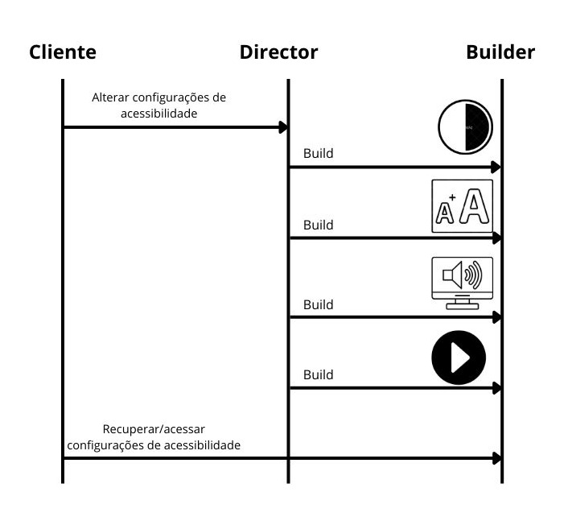
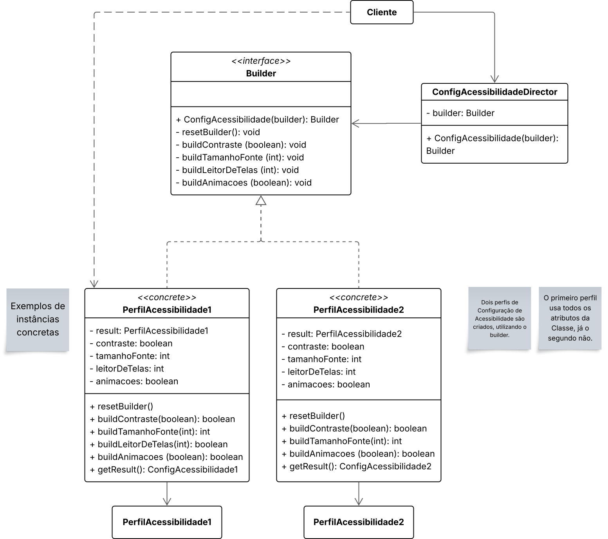

# 3.1.- GoFs Criacionais

## Builder 

O Builder é um padrão de projeto do qual o principal objetivo é **separar** a criação de um objeto complexo para que possamos criar diferentes representações dele. 

Dessa forma, o Builder cria objetos pela contrução *step-by-step*, de forma a construí-lo com a execução de vários passos [2].

Esse padrão pode ser observado em restaurantes de fast-food para a preparação de lanches infantis, por exemplo. Um lanche infantil é composto, geralmente, por um item principal, um acompanhamento, uma bebida e um brinde. Essa composição pode possuir diversas variações em cada um dos itens para a montagem de diferentes tipos de lanches diferentes.

Seguindo essa ideia, pensou-se na aplicação de um Builder na classe responsável pela configuração de acessibilidade do BrinCalango. Essa ideia partiu do princípio de que o BrinCalango tem como objetivo fornecer uma interface amigável para diversos grupos diferentes de crianças e, por isso, possui diferentes funções de acessibilidade para poder trazer maior inclusão. Sabemos também que diferentes grupos exigem diferentes perfis de acessibilidade, no qual uma função de acessibilidade não precisa estar ativada para um determinado grupo "A", enquanto é de suma importância para um grupo "B".

Dessa forma, a adoção do padrão Builder no BrinCalango mostrou-se útil por permitir a criação flexível de diferentes configurações de acessibilidade, atendendo às necessidades específicas de cada grupo de crianças sem a necessidade de criar inúmeras subclasses ou interfaces complexas. Isso simplifica o processo de configuração e manutenção, garantindo uma experiência mais inclusiva e personalizada para os usuários do sistema.

### Esquema ilustrativo do Builder de Configuração de Acessibilidade

Com o objetivo de facilitar a compreensão do padrão de projeto **Builder** na aplicação BrinCalango, foi desenvolvido um esquema ilustrativo, presente na Figura 1, que representa a interação entre três componentes principais: o **Cliente**, o **Director** e o **Builder**.

O processo se inicia com o Cliente solicitando a alteração das configurações de acessibilidade. Essa solicitação é repassada ao Director, que tem a função de orquestrar a construção do objeto final – neste caso, um conjunto de configurações personalizadas para acessibilidade. O Director conhece os passos necessários para montar esse objeto, mas não precisa conhecer os detalhes de implementação de cada etapa. Ele apenas coordena a execução dos métodos do Builder.

O Builder é o componente responsável por realizar as etapas de construção de fato. Cada "build" representado no esquema corresponde a uma configuração específica de acessibilidade que está sendo definida. Os ícones no lado direito ajudam a representar visualmente essas configurações:

- O primeiro ícone, com um círculo dividido entre branco e preto, representa a ativação do **modo de alto contraste**, ideal para usuários com baixa visão.
- O segundo ícone, com duas letras "A" de tamanhos diferentes, simboliza o **aumento do tamanho da fonte**, para facilitar a leitura do conteúdo textual.
- O terceiro ícone, com um alto-falante, indica a ativação de um **leitor de telas**, essencial para usuários com deficiência visual.
- O quarto ícone, com um botão de play/pause, está relacionado à **configuração de animações**, permitindo que o sistema desative ou pause elementos animados, o que é útil para pessoas com deficiências fotossensível ou com dificuldades cognitivas.

Ao final desse processo, o Cliente pode acessar ou recuperar a configuração personalizada construída. O esquema evidencia como o padrão Builder permite a criação de objetos complexos de forma estruturada, oferecendo flexibilidade na montagem e facilitando a adaptação às necessidades específicas de cada usuário.

<strong>Figura 1 – Fluxograma ilustrativo do padrão Builder aplicado à configuração de acessibilidade</strong>

<em>Autor: <a href="https://github.com/julia-fortunato" target="_blank">Júlia Fortunato</a>, <a href="https://github.com/andre-maia51" target="_blank">André Cláudio</a>, 2025</em>

### Modelagem do Builder de Configuração de Acessibilidade

#### Imagem

Na Figura 2, encontra-se a modelagem para o Builder de Configuração de Acessibilidade.

<strong>Figura 2 – Modelagem do Builder de Configuração de Acessibilidade </strong>

<em>Autor: <a href="https://github.com/julia-fortunato" target="_blank">Júlia Fortunato</a>, <a href="https://github.com/andre-maia51" target="_blank">André Cláudio</a>, 2025</em>

#### Frame interativo da modelagem do Builder

<iframe allowfullscreen frameborder="0" style="width:1000px; height:500px" src="https://lucid.app/documents/embedded/2d83e371-90ce-4f3d-af08-fe71bfb54e1b" id="YEkiwTVEnZWG"></iframe>

## Referências Bibliográficas

> [1] REFRACTORING.GURU. Builder. [S. l.], [s. d.]. Disponível em: https://refactoring.guru/design-patterns/builder. Acesso em: 23 maio. 2025.

## Bibliografia 

> SOURCEMAKING. Builder. [S. l.], [s. d.]. Disponível em: https://sourcemaking.com/design_patterns/builder. Acesso em: 23 maio. 2025.

## Histórico de Versões
| Versão | Data       | Descrição                                    | Autor(es)                                                                                              | Revisor(es)                                      | Descrição da Revisão                                                                                  | Commits |
| :----: | ---------- | -------------------------------------------- | -------------------------------------------------------------------------------------------------------- | ------------------------------------------------ | ------------------------------------------------------------------------------------------------------ | -------- |
| 1.0    | 23/05/2025 | Criação e Documentação do Builder | [Andre Cláudio](https://github.com/andre-maia51), [Júlia Fortunato](https://github.com/julia-fortunato) | - | - | - |

