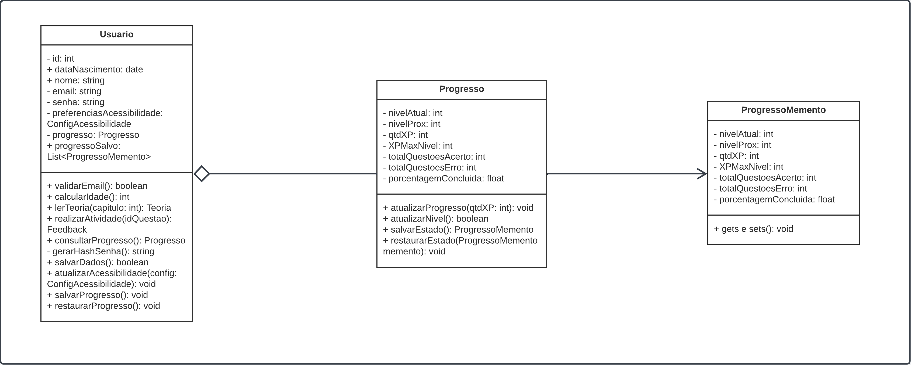

# Memento

O padrão Memento foi escolhido por sua capacidade de capturar e restaurar o estado interno de um objeto sem violar o encapsulamento. Isso se alinha perfeitamente com a necessidade de salvar e restaurar o progresso do usuário (nível, XP, acertos, erros etc.) de forma transparente.

## Estrutura do Memento na Modelagem

A modelagem foi dividida em três classes principais:

### 1. **Progresso (Originador)**
- Guarda o estado atual do progresso do usuário.
- Responsável por criar e restaurar objetos `ProgressoMemento`.
- Métodos principais:
  - `salvarEstado(): ProgressoMemento`
  - `restaurarEstado(ProgressoMemento)`

### 2. **ProgressoMemento (Memento)**
- Armazena o estado do progresso (níveis, XP, acertos etc.).
- Não permite alterações diretas no estado original.
- É imutável e usado apenas para restauração.

### 3. **Usuario (Cuidador)**
- Mantém os mementos em `progressoSalvo`.
- Aciona os métodos de salvar/restaurar do progresso.
- Métodos principais:
  - `salvarProgresso()`
  - `restaurarProgresso()`

---

## Benefícios Observados

- **Segurança e simplicidade**: ideal para crianças — o progresso é salvo automaticamente sem exigir ações complexas.
- **Recuperação fácil**: evita frustração em caso de erro ou queda de sistema.
- **Extensibilidade**: permite futuras implementações como "voltar para checkpoint" ou "repetir nível".

---

## Exemplo de Fluxo

1. A criança completa um conjunto de questões.
2. O método `salvarProgresso()` é chamado, e o estado é armazenado como `ProgressoMemento`.
3. Se necessário, o método `restaurarProgresso()` recupera o progresso anterior sem expor os detalhes internos da lógica de XP e níveis.

## Modelagem do Memento

Na Figura 2, encontra-se a modelagem para o Memento 

<strong>Figura 2 – Modelagem do Factory Method  </strong>

<em>Autor: <a href="https://github.com/andre-maia51" target="_blank">André Maia</a>, <a href="https://github.com/luanasoares0901" target="_blank">Luana</a> e <a href="https://github.com/ailujana" target="_blank">Ana Julia</a>, 2025</em>

## Frame interativo da modelagem do Memento

<iframe allowfullscreen frameborder="0" style="width:640px; height:480px" src="https://lucid.app/documents/embedded/ab4b32b3-4349-4cbd-90ad-b51ce4c55466" id="Ys8kvwa65fiR"></iframe>

## Implementação do Memento

## (i) Autores:
- Ana Júlia Mendes Santos  
- André Maia
- Luana Ribeiro Soares

**Observação**: rastro dos commits está no histórico de versões no fim da página.

##  (ii) Justificativas & senso crítico

- **Isolamento do estado**: permite capturar o estado do objeto `Progresso` em um ponto específico no tempo.
- **Reversibilidade**: possibilita restaurar estados anteriores — útil em casos de erro, redefinição de progresso ou simulação.
- **Encapsulamento preservado**: o `Usuario` interage com snapshots (`ProgressoMemento`) sem acessar diretamente os dados internos de `Progresso`.
- **Histórico de progresso**: o atributo `progressoSalvo: List<ProgressoMemento>` permite manter múltiplos estados salvos.

Embora o padrão Memento seja poderoso, ele também pode aumentar o consumo de memória se muitos estados forem armazenados indiscriminadamente. No contexto infantil, isso é mitigado pela simplicidade dos dados e pela limitação dos checkpoints de salvamento.

##  (iii) Comentários sobre o trabalho em equipe

- O trabalho foi dividido de forma colaborativa entre a equipe;
- As decisões sobre uso do padrão foram debatidas em reuniões curtas, promovendo aprendizado mútuo e engajamento;
- A modelagem foi relaizada em conjunto durante reunião.

## Bibiografia

> [1] Refactoring.Guru. Padrão de Projeto Memento. Disponível em: https://refactoring.guru/pt-br/design-patterns/memento. Acesso em: 30 maio 2025.

> [2] GAMMA, Erich et al. Padrões de projeto: soluções reutilizáveis de software orientado a objetos. Porto Alegre: Bookman, 2009. Acesso em: 30 maio 2025.

> [3] ALMEIDA, Alexandre. Padrões de Projeto em Java: Soluções reutilizáveis com Design Patterns. São Paulo: Novatec, 2014.Acesso em: 30 maio 2025.

> [4] LARMAN, Craig. Utilizando UML e Padrões: uma introdução à análise e ao projeto orientados a objetos e ao processo unificado. 3. ed. Porto Alegre: Bookman, 2007.Acesso em: 30 maio 2025.

 
## Histórico de Versões
| Versão | Data | Descrição | Autor(es) | Revisor(es) | Descrição da Revisão | Commits |
| ------ | ---- | --------- | --------- | ----------- | -------------------- | ------- |
| 1.1 | 30/05/2025 | Documentação da modelagem| [Ana Julia](https://github.com/ailujana), [André Maia](http://github.com/andre-maia51) e [Luana Ribeiro](https://github.com/luanasoares0901) | | | |
