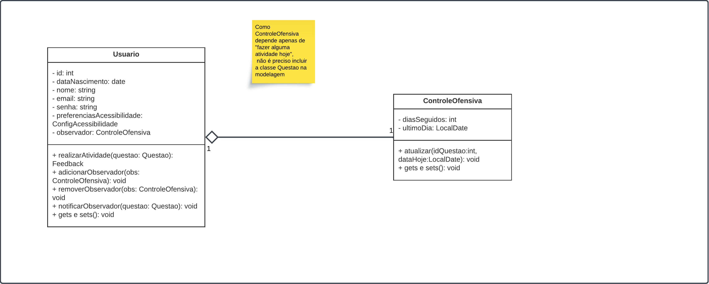

# 3.2 - GoFs Comportamentais

# Observer no BrinCalango

## Definição
O padrão **Observer** é um dos padrões comportamentais definidos pelos GoF (Gang of Four), que estabelece uma dependência um-para-muitos entre objetos, de forma que, quando um objeto muda de estado, todos os seus dependentes são notificados automaticamente (Gamma et al., 1994; Refactoring.Guru, 2025).

## Aplicação no Projeto BrinCalango

### Contexto

No BrinCalango, há a necessidade de rastrear o comprometimento dos usuários com a realização de atividades diárias. O sistema implementa um controle denominado `ControleOfensiva` que monitora a quantidade de dias seguidos em que o usuário realiza atividades. Sempre que um usuário realiza uma atividade, ele notifica automaticamente o `ControleOfensiva` para atualizar esse controle.

Essa necessidade foi identificada e modelada durante as atividades práticas da disciplina de Arquitetura de Software, sob a orientação da professora Milene (UnB, 2025).

### Problema
Manter o controle da ofensiva do usuário atualizado manualmente após cada atividade tornaria o sistema frágil, com alto acoplamento entre a lógica de realização de atividades e o controle de ofensiva.

### Solução com Observer
Com o padrão **Observer**, é possível:

- O `Usuario` notifica automaticamente os objetos `ControleOfensiva` associados a ele.
- `ControleOfensiva` atualiza os dias seguidos e a data do último dia ao ser notificado.

Essa abordagem favorece a separação de responsabilidades e reduz o acoplamento, alinhando-se às boas práticas recomendadas por Gamma et al. (1994).

## Estrutura da Implementação

```plaintext

```

## Modelagem

<div align="center">



</div>

<p align="center"><em></em></p>

### Diagrama no Lucidchart

[Acesse o diagrama interativo no Lucidchart](link)

#### Frame interativo da modelagem do Prototype
<div style="width: 1000px; height: 500px; margin: 10px; position: relative;"><iframe allowfullscreen frameborder="0" style="width:1000px; height:500px" src="link" id="YEkiwTVEnZWG"></iframe></div>

## Implementação do Observer

### Classe `Usuario`

```java

 public void realizarAtividade(Questao questao){
        System.out.println("Realizando a atividade "+questao.getId()+"!");
        notificarObservadores(questao);
    }

    // Observer
    private void notificarObservadores(Questao questao){
        System.out.println("Notificando Observadores!");
        for(ControleOfensiva obs: this.observer) {
            obs.atualizar(questao.getId(), LocalDate.now());
        }
    }

    public void adicionarObservador(ControleOfensiva obs){
        System.out.println("Adicionando Observador!");
        this.observer.add(obs);
    }

    public void removerObservador(ControleOfensiva obs){
        System.out.println("Removendo Observador!");
        this.observer.remove(obs);
    }

```

Função `realizarAtividade(Questao questao)`

```java
public void realizarAtividade(Questao questao){
    System.out.println("Realizando a atividade "+questao.getId()+"!");
    notificarObservadores(questao);
}
```

- Quando o usuário realiza uma atividade, este método é chamado.
- Exibe uma mensagem indicando que a atividade está sendo realizada.
- Chama `notificarObservadores(questao)`, que informa todos os `ControleOfensiva` associados.

--> Após a realização de qualquer atividade, o controle de ofensiva é atualizado automaticamente, sem necessidade de uma chamada manual.


Função `notificarObservadores(Questao questao)`

```java
private void notificarObservadores(Questao questao){
    System.out.println("Notificando Observadores!");
    for(ControleOfensiva obs: this.observer) {
        obs.atualizar(questao.getId(), LocalDate.now());
    }
}
```

- Percorre todos os `ControleOfensiva` associados ao usuário.
- Para cada um, chama `atualizar`, passando o ID da questão e a data atual.

--> Garante que o registro da ofensiva do usuário se mantenha correto e atualizado automaticamente, a cada atividade realizada.


Função `adicionarObservador(ControleOfensiva obs)`

```java
public void adicionarObservador(ControleOfensiva obs){
    System.out.println("Adicionando Observador!");
    this.observer.add(obs);
}
```

- Permite que um novo `ControleOfensiva` seja associado ao usuário.
- Adiciona o observador na lista `observer` do usuário.

--> O sistema pode iniciar ou expandir o controle de ofensiva do usuário a qualquer momento.


Função `removerObservador(ControleOfensiva obs)`

```java
public void removerObservador(ControleOfensiva obs){
    System.out.println("Removendo Observador!");
    this.observer.remove(obs);
}
```

- Permite que um `ControleOfensiva` seja removido da lista de observadores.
- Garante que o usuário pare de notificar aquele controle específico.

--> Caso o usuário queira **pausar ou resetar** o controle da ofensiva, o sistema pode remover o observador facilmente.

### Classe `ControleOfensiva`

```java
    public ControleOfensiva(int diasSeguidos, LocalDate ultimoDia) {
        this.diasSeguidos = diasSeguidos;
        this.ultimoDia = ultimoDia;
    }

    public void atualizar(int questaoId, LocalDate dataHoje){
        this.diasSeguidos += 1;
        this.ultimoDia = dataHoje;
    }
```

Construtor `ControleOfensiva(int diasSeguidos, LocalDate ultimoDia)`

```java
public ControleOfensiva(int diasSeguidos, LocalDate ultimoDia) {
    this.diasSeguidos = diasSeguidos;
    this.ultimoDia = ultimoDia;
}
```
- Permite criar uma nova instância definindo diretamente:
    - O número de dias seguidos que o usuário já possui (diasSeguidos).
    - A data do último dia em que o usuário realizou uma atividade (ultimoDia).

--> Quando o sistema precisa inicializar o controle de ofensiva com dados recuperados, garantindo que o estado atual do usuário seja mantido ao iniciar o sistema.

Método atualizar(int questaoId, LocalDate dataHoje)

```java
public void atualizar(int questaoId, LocalDate dataHoje){
    this.diasSeguidos += 1;
    this.ultimoDia = dataHoje;
}
```

- Chamado sempre que o usuário realiza uma nova atividade.
- Incrementa diasSeguidos em 1, indicando que o usuário manteve a sequência de atividades.
- Atualiza ultimoDia com a data atual (dataHoje), refletindo o dia mais recente em que o usuário realizou uma atividade.

--> Manter o registro correto do comprometimento do usuário com as atividades. A cada nova atividade, o sistema atualiza automaticamente: o número de dias consecutivos e a data mais recente de realização.

> **Observação**: A `Main.java` foi utilizada para testes, implementada apenas para validar o funcionamento do padrão Observer.

## Vantagens obtidas

- **Desacoplamento**: O `Usuario` não precisa conhecer os detalhes de implementação de `ControleOfensiva`.
- **Reusabilidade**: Facilita a adição de novos tipos de observadores no futuro.
- **Manutenção**: Simplifica a evolução do sistema, pois alterações no controle de ofensiva não impactam a classe `Usuario`.

## (i) Autores:
Modelagem: 
- Maria Clara Oleari de Araujo

Implementação:
- Julia Rocha Fortunato
- Maria Clara Oleari de Araujo
- Maurício Ferreira de Araújo

**Observação**: rastro dos commits está no histórico de versões no fim da página.

## (ii) Justificativas & senso crítico

- **Escolha do padrão**: O Observer foi escolhido para implementar um mecanismo de notificação automática e desacoplada entre o `Usuario` e o `ControleOfensiva`.
- **Alinhamento com boas práticas**: A aplicação do padrão respeita princípios como o OCP (Open-Closed Principle) e SRP (Single Responsibility Principle).

## (iii) Comentários sobre o trabalho em equipe

- O trabalho foi dividido colaborativamente, com modelagem feita no Lucidchart e implementação em Java.
- Durante a reunião geral do foco específico, foi selecionado e debatido a justificativa de seleção dos padrões escolhidos
- Foi dividido grupos para a modelagem e para a implementação.
- Na implementação, a comunicação foi essecial, além de uma participação ativa dos membros.

## Referências

> [1] Gamma, E., Helm, R., Johnson, R., & Vlissides, J. (1994). *Design Patterns: Elements of Reusable Object-Oriented Software*.

> [2] Refactoring.Guru. [Observer](https://refactoring.guru/design-patterns/observer).

> [3] Arquitetura de Software – Profa. Milene – UnB (2025).

##  Histórico de Versões

| Versão | Data       | Descrição                                    | Autor(es)                                                                                              | Revisor(es)                                      | Descrição da Revisão                                                                                  | Commits |
| :----: | ---------- | -------------------------------------------- | ------------------------------------------------------------------------------------------------------ | ------------------------------------------------ | ------------------------------------------------------------------------------------------------------ | ------- |
| 1.0    | 01/06/2025 | Documentação e escopo da modelagem        | [Maria Clara](https://github.com/Oleari19)                        | -                                              | -                                                                                            | [Commit 1](https://github.com/UnBArqDsw2025-1-Turma02/2025.1-T02-_G1_BrinCalango_Entrega_03/commit/1c56a6207dacd49e15db38ae6d41167a5aa2f359) |
| 1.1    | 01/06/2025 | Documentação da implementação        | [Júlia Fortunato](https://github.com/julia-fortunato), [Maria Clara](https://github.com/Oleari19) e [Mauricio Ferreira](https://github.com/mauricio-araujoo)  | -                                              | -                                                                                            | [Commit 2.1](https://github.com/UnBArqDsw2025-1-Turma02/2025.1-T02-_G1_BrinCalango_Entrega_03/commit/0ef1e80f3727d2588cb92fd729f06d3348e97518) e [Commit 2.2](https://github.com/UnBArqDsw2025-1-Turma02/2025.1-T02-_G1_BrinCalango_Entrega_03/commit/1c56a6207dacd49e15db38ae6d41167a5aa2f359)|

