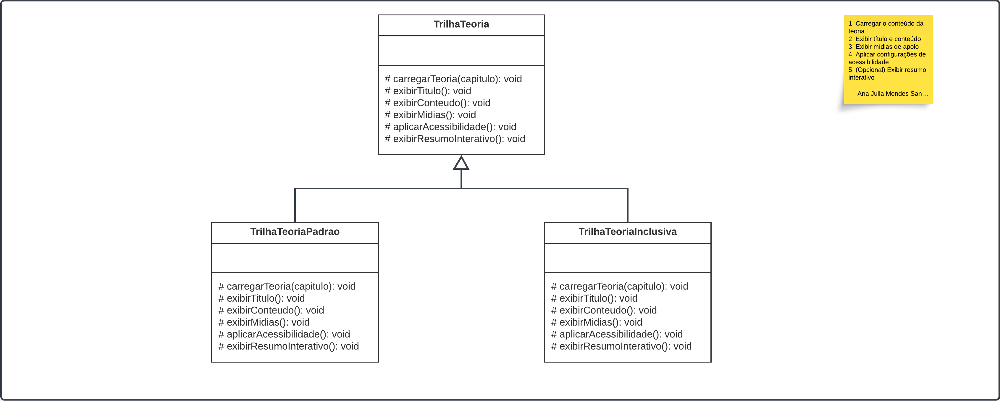

# Template Method no BrinCalango

## Definição
O padrão **Template Method**, conforme definido por Gamma et al. (1994), permite definir o **esqueleto de um algoritmo** em uma operação, **postergando** a definição de alguns passos para subclasses. Esse padrão promove reutilização e controle sobre a ordem de execução dos métodos, evitando duplicação de código.

## Aplicação no Projeto BrinCalango

### Contexto
O BrinCalango possui uma funcionalidade chamada **Trilha de Teoria**, com subclasses `TrilhaTeoriaPadrao` e `TrilhaTeoriaInclusiva`. Ambas seguem a mesma lógica base: exibir um conteúdo teórico com título, mídias e acessibilidade, com a opção de exibir um resumo interativo. A sequência de exibição precisa ser padronizada.

### Problema
A necessidade de garantir que **todos os tipos de trilha sigam a mesma ordem de execução** dos passos lógicos (carregar conteúdo, exibir título, etc.) poderia levar à duplicação de lógica em várias subclasses, dificultando a manutenção.

### Imagem

<em>Autores: 
<a href="mailto:ailujana@gmail.com">Ana Júlia</a>, 
<a href="mailto:acmc.0410@gmail.com">André Maia</a>,
<a href="mailto:victorhugorodriguesguimaraes@gmail.com">Victor Hugo</a>, 
<a href="mailto:julia.takaki@gmail.com">Júlia Takaki</a>, 
<a href="mailto:luana.soares0901@gmail.com">Luana Soares</a>, 
<a href="mailto:diogorodriguesbb@gmail.com">Diogo Barboza</a>, 
<a href="mailto:an4catarina@gmail.com">Ana Catarina</a>, 2025</em>

### Diagrama no Lucidchart

[Acesse o diagrama interativo no Lucidchart](https://lucid.app/lucidchart/ab4b32b3-4349-4cbd-90ad-b51ce4c55466/edit?viewport_loc=-2825%2C-1381%2C4989%2C2373%2C0_0&invitationId=inv_4a43ec74-d298-437f-803c-87bfacedd241)

### Diagrama interativo

<iframe allowfullscreen frameborder="0" style="width:640px; height:480px" src="https://lucid.app/documents/embedded/ab4b32b3-4349-4cbd-90ad-b51ce4c55466" id="se8kNbQzaXBk"></iframe>

### Solução com Template Method
A classe abstrata `TrilhaTeoria` define o esqueleto do algoritmo na forma de um **método template**, garantindo que a ordem dos passos seja mantida:
As subclasses (`TrilhaTeoriaPadrao` e `TrilhaTeoriaInclusiva`) implementam esses métodos conforme necessário.

## Vantagens obtidas

- **Ordem garantida** de execução dos passos;
- **Reutilização de lógica comum**;
- **Facilidade de extensão** para novas trilhas;
- **Adição de hooks** opcionais como o resumo interativo.

## (i) Autores:
- Ana Júlia Mendes Santos  
- André Cláudio Maia da Cunha
- Ana Catarina Lopes e Vasconcelos dos Santos
- Júlia Takaki Neves
- Diogo Rodrigues Barboza
- Luana Ribeiro Soares
- Victor Hugo Rodrigues Guimarães

**Observação**: rastro dos commits está no histórico de versões no fim da página.

## (ii) Justificativas & senso crítico

- **Escolha dos padrões**: O Template Method foi escolhido para garantir consistência no fluxo de execução das trilhas de teoria.
- **Alinhamento com boas práticas**: Promovem alta coesão e baixo acoplamento entre as classes.
- A escolha foi embasada em estudos clássicos (Gamma et al., 1994) e recursos contemporâneos (Refactoring.Guru, 2025).

## (iii) Comentários sobre o trabalho em equipe

- O trabalho foi distribuído entre as integrantes conforme afinidade com os padrões;
- As decisões de design e implementação foram discutidas em grupo;
- A modelagem foi feita de forma colaborativa com validações iterativas entre o time durante a aula de dúvidas.

## Referências

- Gamma, E., Helm, R., Johnson, R., & Vlissides, J. (1994). *Design Patterns: Elements of Reusable Object-Oriented Software*.
- Refactoring.Guru. [Template Method](https://refactoring.guru/design-patterns/template-method)
- BrinCalango – Profa. Milene – UnB (2025)

##  Histórico de Versões

| Versão | Data       | Descrição                                    | Autor(es)                                                                                              | Revisor(es)                                      | Descrição da Revisão                                                                                  | Commits |
| :----: | ---------- | -------------------------------------------- | ------------------------------------------------------------------------------------------------------ | ------------------------------------------------ | ------------------------------------------------------------------------------------------------------ | ------- |
| 1.0    | 01/06/2025 | Documentação e escopo da modelagem           | [Victor Hugo](mailto:victorhugorodriguesguimaraes@gmail.com), [Júlia Takaki](mailto:julia.takaki@gmail.com), [Luana Soares](mailto:luana.soares0901@gmail.com), [Diogo Barboza](mailto:diogorodriguesbb@gmail.com), [Ana Catarina](mailto:an4catarina@gmail.com), [Ana Júlia](mailto:ailujana@gmail.com), [André Maia](mailto:acmc.0410@gmail.com) | - | - | [Commit 1](https://github.com/UnBArqDsw2025-1-Turma02/2025.1-T02-_G1_BrinCalango_Entrega_03/commit/1c56a6207dacd49e15db38ae6d41167a5aa2f359) |
