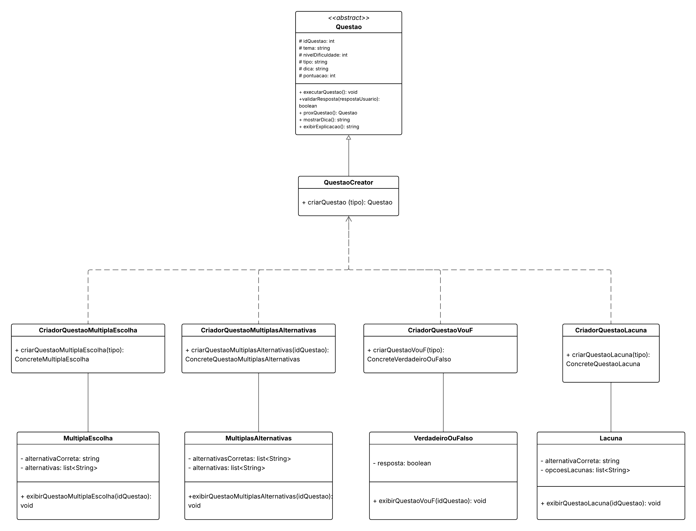

# 3.1.- GoFs Criacionais

## Factory Method 

O padrão de projeto Factory Method é um padrão criacional que define uma interface para a criação de objetos, permitindo que as subclasses escolham qual tipo de objeto será instanciado. Essa abordagem promove flexibilidade e reduz o acoplamento entre o código que usa os objetos e suas classes concretas, facilitando a extensão do sistema sem modificar seu núcleo.

#### Benefícios

- Facilita a extensão do código com novos tipos de objetos.
- Reduz o acoplamento entre o código cliente e as classes concretas.
- Encapsula a lógica de criação dos objetos.


### Modelagem do Factory Method 

Na Figura 2, encontra-se a modelagem para o Factory Method 

<div align="center">

<p><strong>Figura 2 – Modelagem do Factory Method  </strong></p>



<p><em>Autor: <a href="https://github.com/julia-fortunato" target="_blank">Júlia Fortunato</a>, <a href="https://github.com/luanasoares0901" target="_blank">Luana</a> e <a href="https://github.com/ailujana" target="_blank">Ana Julia</a>, 2025</em></p>

</div>

A seguir, descrevemos as classes envolvidas e sua função no padrão.

#### Classe Abstrata `Questao`

Representa o **produto abstrato**.

```plaintext
Atributos:
- idQuestao: int
- tema: string
- nivelDificuldade: int
- tipo: string
- dica: string
- pontuacao: int

Métodos:
+ executarQuestao(): void
+ validarResposta(respostaUsuario): boolean
+ proxQuestao(): Questao
+ mostrarDica(): string
+ exibirExplicacao(): string
```

---

#### Subclasses de `Questao` (Produtos Concretos)

##### `MultiplaEscolha`
- alternativaCorreta: string
- alternativas: list<string>
-  + exibirQuestaoMultiplaEscolha(idQuestao): void

##### `EscolhaMultipla`
- alternativasCorretas: list<string>
- alternativas: list<string>
-  + exibirQuestaoEscolhaMultipla(idQuestao): void

##### `VerdadeiroOuFalso`
- resposta: boolean
-  + exibirQuestaoVouF(idQuestao): void

##### `Lacuna`
- alternativaCorreta: string
- opcoesLacunas: list<string>
-  + exibirQuestaoLacuna(idQuestao): void

---

#### Criador Abstrato `QuestaoCreator`

Define o método de fábrica:

```plaintext
+ criarQuestao(): Questao
```

---

#### Criadores Concretos

Implementam o método de fábrica instanciando as subclasses de `Questao`.

##### `CriadorQuestaoMultiplaEscolha`
```plaintext
+ criarQuestao(): MultiplaEscolha
```

##### `CriadorQuestaoEscolhaMultipla`
```plaintext
+ criarQuestao(): EscolhaMultipla
```

##### `CriadorQuestaoVouF`
```plaintext
+ criarQuestao(): VerdadeiroOuFalso
```

##### `CriadorQuestaoLacuna`
```plaintext
+ criarQuestao(): Lacuna
```

---

#### Frame interativo da modelagem do Factory Method

<div style="width: 640px; height: 480px; margin: 10px; position: relative;"><iframe allowfullscreen frameborder="0" style="width:640px; height:480px" src="https://lucid.app/documents/embedded/3d29c102-1433-45c0-8e62-4555223031e1" id="9e2iZ.B9riZr"></iframe></div>

### Implementação do Factory Method

```
import java.util.List;
import java.util.ArrayList;

// Produto Abstrato
abstract class Questao {
    int idQuestao;
    String tema, nivelDificuldade, tipo, enunciado, explicacao;
    int pontuacao;

    abstract void executar();

    boolean validarResposta(String respostaUsuario) { return true; }

    Questao proximaQuestao() { return null; }

    String mostrarEnunciado() { return enunciado; }

    String exibirExplicacao() { return explicacao; }
}

// Produto Concreto 1
class MultiplaEscolha extends Questao {
    String alternativaCorreta;
    List<String> alternativas;

    void executar() { System.out.println("Criando questão do tipo: Multipla Escolha"); }
}

// Produto Concreto 2
class MultiplasAlternativas extends Questao {
    List<String> alternativasCorretas;
    List<String> alternativas;

    void executar() { System.out.println("Criando questão do tipo: Multiplas Alternativas"); }
}

// Produto Concreto 3
class VerdadeiroOuFalso extends Questao {
    boolean resposta;

    void executar() { System.out.println("Criando questão do tipo: Verdadeiro ou Falso"); }
}

// Produto Concreto 4
class Lacuna extends Questao {
    String alternativaCorreta;
    List<String> opcoesLacunas;

    void executar() { System.out.println("Criando questão do tipo: Lacuna"); }
}

// Criador Abstrato
abstract class QuestaoCreator {
    abstract Questao criarQuestao(String tipo);
}

// Criadores Concretos
class CriadorQuestaoMultiplaEscolha extends QuestaoCreator {
    Questao criarQuestao(String tipo) { return new MultiplaEscolha(); }
}

class CriadorQuestaoMultiplasAlternativas extends QuestaoCreator {
    Questao criarQuestao(String tipo) { return new MultiplasAlternativas(); }
}

class CriadorQuestaoVouF extends QuestaoCreator {
    Questao criarQuestao(String tipo) { return new VerdadeiroOuFalso(); }
}

class CriadorQuestaoLacuna extends QuestaoCreator {
    Questao criarQuestao(String tipo) { return new Lacuna(); }
}

// Classe Principal todo main

class Principal {
    public static void main(String[] args) {
        QuestaoCreator criadorVF = new CriadorQuestaoVouF();
        QuestaoCreator criadorME = new CriadorQuestaoMultiplaEscolha();
        QuestaoCreator criadorMA = new CriadorQuestaoMultiplasAlternativas();
        QuestaoCreator criadorLacuna = new CriadorQuestaoLacuna();


        Questao vf = criadorVF.criarQuestao("VF");
        Questao me = criadorME.criarQuestao("Multipla Escolha");
        Questao ma = criadorMA.criarQuestao("Multipla Alternativa");
        Questao lacuna = criadorLacuna.criarQuestao("Lacuna");


        vf.executar();
        me.executar();
        ma.executar();
        lacuna.executar();
    }
}
```

## Bibliografia 

> [1] REFRACTORING.GURU. Factory Metho. [S. l.], [s. d.]. Disponível em: https://refactoring.guru/design-patterns/factory-method. Acesso em: 25 maio. 2025.

> [2] Gamma, Erich, et al. *Design Patterns: Elements of Reusable Object-Oriented Software*. Addison-Wesley, 1994. Acesso em: 20 de maio. 2025.

> [3] Larman, Craig. *Utilizando UML e Padrões*. Bookman, 3ª ed., 2007. Acesso em: 20 de maio. 2025.

> [4]https://www.geeksforgeeks.org/factory-method-design-pattern-in-java/ Acesso em: 20 de maio. 2025.

 

## Histórico de Versões
| Versão | Data | Descrição | Autor(es) | Revisor(es) | Descrição da Revisão | Commits |
| ------ | ---- | --------- | --------- | ----------- | -------------------- | ------- |
| 1.0 | 25/05/2025 | Estruturação e Inclusão da implementação | [Ana Catarina](https://github.com/an4catarina) e [Victor Hugo](http://github.com/ViictorHugoo) | | | |
| 1.1 | 30/05/2025 | Documentação da modelagem| [Ana Julia](https://github.com/ailujana), [Julia Fortunato](http://github.com/julia-fortunato) e [Luana Ribeiro](https://github.com/luanasoares0901) | | | |
