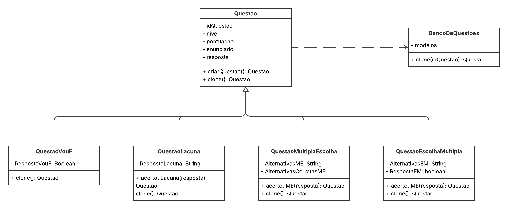

# 3.1.- GoFs Criacionais

#  Prototype no BrinCalango

##  Definição
O padrão **Prototype** é um dos padrões criacionais definidos pelos GoF (Gang of Four) que permite **clonar objetos existentes** sem acoplá-los ao código que os cria. Ele é especialmente útil quando a criação de novos objetos a partir do zero é custosa ou complexa (Gamma et al., 1994; Refactoring.Guru, 2025).

##  Aplicação no Projeto BrinCalango

### Contexto
No BrinCalango, temos o conceito de **questões padronizadas**, como *QuestaoVouF*, *QuestaoLacuna*, *QuestaoMultiplaEscolha* e *QuestaoEscolhaMultipla*, armazenadas em um repositório chamado `BancoDeQuestoes`. A lógica do jogo exige gerar novas instâncias dessas questões diversas vezes — por exemplo, ao criar provas, rodadas de treino ou simulações. Essa necessidade foi evidenciada durante os estudos da disciplina de Arquitetura de Software, conforme orientações da professora Milene (UnB, 2024).

### Problema
Criar novas questões do zero exigiria uma lógica extra para configurar o nível, alternativas, pontuação, enunciado, etc., o que se tornaria repetitivo e propenso a erros.

### Solução com Prototype
Com o padrão **Prototype**, é possível:
- Criar uma **questão-modelo**;
- Armazená-la no `BancoDeQuestoes`;
- Cloná-la rapidamente com `.clone()` para gerar múltiplas instâncias similares, com as mesmas configurações.

Essa abordagem segue o modelo recomendado por Gamma et al. (1994) e exemplificado em Refactoring.Guru (2025), onde o uso de `.clone()` encapsula a lógica de duplicação respeitando os princípios de responsabilidade única.

## Estrutura da Implementação

```plaintext
┌────────────────────┐
│     Questao        │◄────────────┐
│────────────────────│             │
│+idQuestao          │             │
│+nivel              │             │
│+pontuacao          │             │
│+enunciado          │             │
│+resposta           │             │
│+clone(): Questao   │             │
└────────────────────┘             │
        ▲                          │
 ┌──────┼────────┐     ┌───────────┘
 ▼      ▼        ▼     
QuestaoVouF   QuestaoLacuna   QuestaoMultiplaEscolha
QuestaoEscolhaMultipla
(todas implementam clone())
```

```plaintext
BancoDeQuestoes
- modelos: Mapa de idQuestao → Questao
+ clone(idQuestao): Questao
```

---

### Imagem

<div align="center">



</div>

<p align="center"><em>Autor: <a href="https://github.com/ailujana" target="_blank">Ana Júlia</a>, <a href="https://github.com/Oleari19" target="_blank">Maria Clara</a>, 2025</em></p>


### Diagrama no Lucidchart

[Acesse o diagrama interativo no Lucidchart](https://lucid.app/lucidchart/5297f22b-c775-46c0-a384-1254419ea4e8/edit?invitationId=inv_5365ef39-e274-4853-aeba-90716661d7b4&page=0_0#)

#### Frame interativo da modelagem do Prototype
<div style="width: 1000px; height: 500px; margin: 10px; position: relative;"><iframe allowfullscreen frameborder="0" style="width:1000px; height:500px" src="https://lucid.app/documents/embedded/5297f22b-c775-46c0-a384-1254419ea4e8" id="YEkiwTVEnZWG"></iframe></div>

## Vantagens obtidas

- **Eficiência**: Redução no custo de criação de objetos complexos.
- **Manutenção**: Permite alterar a questão-modelo e replicar a mudança automaticamente nos clones.
- **Flexibilidade**: Adiciona facilidade na criação de novos tipos de questões sem alterar a lógica do sistema.
- **Desacoplamento**: Separação clara entre criação e uso de objetos.

## (i)Autoras:
- Ana Júlia Mendes Santos  
- Maria Clara Oleari de Araujo

**Observação**: rastro dos commits está no histórico de versões no fim da página.

##  (ii) Justificativas & senso crítico

- **Escolha do padrão**: O Prototype foi escolhido devido à necessidade de gerar **cópias rápidas e seguras** de objetos complexos (questões) sem depender da criação manual.
- **Alinhamento com boas práticas**: A aplicação do padrão respeita princípios como SRP (Single Responsibility Principle), pois o método `.clone()` está encapsulado na própria classe da questão.
- O embasamento teórico está alinhado com a bibliografia clássica (Gamma et al., 1994) e moderna (Refactoring.Guru, 2025).

##  (iii) Comentários sobre o trabalho em equipe

- O trabalho foi dividido de forma colaborativa;
- As decisões sobre uso do padrão foram debatidas em reuniões curtas, promovendo aprendizado mútuo e engajamento.

##  Referências

- Gamma, E., Helm, R., Johnson, R., & Vlissides, J. (1994). *Design Patterns: Elements of Reusable Object-Oriented Software*.
- Refactoring.Guru. [Prototype](https://refactoring.guru/design-patterns/prototype).
- Arquitetura de Software – Profa. Milene – UnB (2024).
- Documentação interna do projeto BrinCalango.

##  Histórico de Versões
| Versão | Data       | Descrição                                    | Autor(es)                                                                                              | Revisor(es)                                      | Descrição da Revisão                                                                                  | Commits |
| :----: | ---------- | -------------------------------------------- | -------------------------------------------------------------------------------------------------------- | ------------------------------------------------ | ------------------------------------------------------------------------------------------------------ | -------- |
| 1.0    | 26/05/2025 | Criação e Documentação do Prototype | [Ana Júlia](https://github.com/ailujana), [Maria Clara](https://github.com/Oleari19) | - | - | [Commit1-1](https://github.com/UnBArqDsw2025-1-Turma02/2025.1-T02-_G1_BrinCalango_Entrega_03/commit/8c27e9e66a1404e0664b4cf0ea93b82e572b6d0e) |
