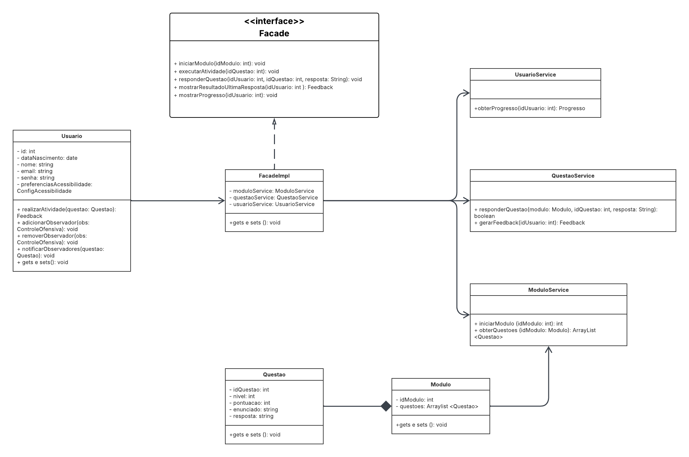

# Facade 

##  Definição
O padrão **Facade** é um dos padrões estruturais do catálogo *GoF* em um subsistema. Ele define uma interface de mais alto nível que torna o subsistema mais fácil de usar.

> Segundo Refactoring.Guru [1]:  
> “O Facade fornece uma interface simplificada para um subsistema complexo, facilitando o uso de bibliotecas ou códigos internos por parte do cliente.”  
> Fonte: [Refactoring Guru - Facade](https://refactoring.guru/pt-br/design-patterns/facade)

Na prática, isso significa que, em vez de lidar com vários serviços diferentes separadamente, você chama um único método da fachada, que cuida de tudo para você nos bastidores. É como apertar um botão “iniciar” e o sistema cuidar de todos os passos internos automaticamente.

Esse padrão é útil especialmente quando o sistema já tem muitos módulos ou classes que precisam trabalhar juntas. Ele ajuda a:

- Organizar o fluxo de execução, deixando o código mais limpo;

- Evitar que o cliente conheça os detalhes internos do sistema;

- Facilitar manutenção e leitura do código no longo prazo.

Um exemplo comum seria em uma plataforma de ensino, onde a fachada pode ser responsável por iniciar um módulo, registrar a resposta de uma questão e mostrar o progresso do aluno — tudo isso com uma única chamada de função.

## Metodologia

Durante uma reunião remota realizada pela plataforma Microsoft Teams, os integrantes do grupo discutiram qual seria o **padrão estrutural mais adequado** para promover uma interface unificada e simplificada na aplicação BrinCalango.

Foi levantada a necessidade de encapsular chamadas para diferentes serviços do sistema — como `ModuloService`, `QuestaoService` e `UsuarioService` — e surgiu a proposta de aplicar o padrão **Facade**.

Após considerações técnicas e análise de alternativas, os membros decidiram em consenso pela adoção do padrão Facade, devido à sua capacidade de:

- Reduzir o acoplamento entre os módulos do sistema;
- Facilitar a manutenção futura e testes;
- Centralizar fluxos de interação com o sistema de forma limpa e acessível.

A implementação do `FacadeImpl` seguiu esse alinhamento, reunindo os principais métodos de uso recorrente por parte de controladores e front-end em uma interface única.


## Imagem

<div align="center">



</div>

<p><em>Autor: <a href="https://github.com/julia-fortunato" target="_blank">Júlia Fortunato</a>, <a href="https://github.com/luanasoares0901" target="_blank">Luana</a>, <a href="https://github.com/ailujana" target="_blank">Ana Julia</a> e <a href="https://github.com/mauricio-araujoo" target="_blank">Maurício</a>, 2025</em></p>


## Diagrama no Lucidchart

[Acesse o diagrama interativo no Lucidchart](https://lucid.app/lucidchart/44e8d0b4-a9a0-47e3-8f2c-3b19c256692c/edit?invitationId=inv_9811db09-efb6-48fd-93e7-b9ed212e6ff3&page=0_0#)

#### Frame interativo da modelagem do Facade
<div style="width: 640px; height: 480px; margin: 10px; position: relative;"><iframe allowfullscreen frameborder="0" style="width:640px; height:480px" src="https://lucid.app/documents/embedded/44e8d0b4-a9a0-47e3-8f2c-3b19c256692c" id="Lq8kb~zelObz"></iframe></div>

## Implementação do Facade

```java
//Facade.java
package application;

import entity.Feedback;
import entity.Modulo;

public interface Facade {
    Modulo iniciarModulo(int idModulo);
    public void executarAtividade(int idQuestao,Modulo modulo,String resposta);
    public void responderQuestao(Modulo modulo, int idQuestao, String resposta);
    Feedback mostrarResultadoUltimaResposta(int idUsuario);
    void mostrarProgresso(int idUsuario);
}
```

```java
//FacadeImpl.java
package application;

import entity.Feedback;
import entity.Modulo;
import service.ModuloService;
import service.QuestaoService;
import service.UsuarioService;

public class FacadeImpl implements Facade{

    private ModuloService moduloService;
    private QuestaoService questaoService;
    private UsuarioService usuarioService;

    public FacadeImpl(ModuloService moduloService, QuestaoService questaoService, UsuarioService usuarioService) {
        this.moduloService = moduloService;
        this.questaoService = questaoService;
        this.usuarioService = usuarioService;
    }

    @Override
    public Modulo iniciarModulo(int idModulo) {
        System.out.println("Iniciando Modulo");
        return moduloService.iniciarModulo(idModulo);
    }

    @Override
    public void executarAtividade(int idQuestao,Modulo modulo,String resposta) {
        System.out.println("Respondendo Questao "+ idQuestao);
        if(questaoService.responderQuestao(modulo,idQuestao,resposta)){
            System.out.println("Acertou!!");
        }else {
            System.out.println("Errou!!");
        }
        System.out.println("Gerando Feedback");
        Feedback fe = questaoService.gerarFeedback(1);
        System.out.println("Feedback da questao "+idQuestao+" com mensagem\n"+fe.getMensagem());

    }

    @Override
    public void responderQuestao(Modulo modulo, int idQuestao, String resposta) {
        System.out.println("Respondendo Questao "+ idQuestao);
        if(questaoService.responderQuestao(modulo,idQuestao,resposta)){
            System.out.println("Acertou!!");
        }else {
            System.out.println("Errou!!");
        }
    }

    @Override
    public Feedback mostrarResultadoUltimaResposta(int idUsuario) {
        System.out.println("Feedback da ultima questao!");
        return null;
    }

    @Override
    public void mostrarProgresso(int idUsuario) {
        System.out.println("Progresso do usuario" + idUsuario);
    }

    public ModuloService getModuloService() {
        return moduloService;
    }

    public void setModuloService(ModuloService moduloService) {
        this.moduloService = moduloService;
    }

    public QuestaoService getQuestaoService() {
        return questaoService;
    }

    public void setQuestaoService(QuestaoService questaoService) {
        this.questaoService = questaoService;
    }

    public UsuarioService getUsuarioService() {
        return usuarioService;
    }

    public void setUsuarioService(UsuarioService usuarioService) {
        this.usuarioService = usuarioService;
    }

}
```
### Interface `Facade`

A interface `Facade` é a aplicação direta do padrão de projeto estrutural Facade, que tem como principal objetivo esconder a complexidade de subsistemas internos e oferecer uma interface única e simplificada para o usuário utilizar.

Com isso, a interface se relaciona com FacadeImpl, que centraliza a execução dos serviços principais do sistema BrinCalango, delegando as operações (métodos) para três serviços especializados, sendo eles:

- ModuloService: responsável por iniciar os módulos de estudo com base no ID fornecido;
- QuestaoService: lida com a lógica de resposta das questões e geração de feedbacks;
- UsuarioService: gerencia e exibe o progresso do usuário.


### Objetivo da Interface

Centralizar a interação com os principais fluxos do sistema BrinCalango, como:

- Iniciar módulos de estudo;
- Executar atividades (responder questões);
- Gerar e mostrar feedbacks;
- Mostrar o progresso do usuário.

Essa centralização facilita o uso do sistema, especialmente por parte de camadas externas como controladores, front-end ou APIs.

## Vantagens obtidas

- **Simplicidade para o cliente**: A camada de fachada fornece uma única interface, reduzindo a complexidade para os usuários/clientes do sistema.
- **Desacoplamento**: Componentes como controladores ou interfaces de usuário não precisam conhecer a lógica interna dos serviços.
- **Facilidade de manutenção**: Mudanças internas nos serviços (ex: troca de implementação) não afetam quem consome o `Facade`.
- **Melhora a legibilidade e organização do código**.

## (i) Autores:
- Ana Júlia Mendes Santos  
- André Cláudio  
- Júlia Rocha Fortunato
- Luana Ribeiro Soares
- Maurício Araújo 

**Observação**: rastro dos commits está no histórico de versões no fim da página.

## (ii) Justificativas & senso crítico

No contexto do projeto **BrinCalango**, o padrão Facade foi adotado para **centralizar a orquestração das funcionalidades principais**: início de módulos, execução de atividades, resposta de questões, geração de feedbacks e visualização do progresso do usuário.

A interface `Facade` e sua implementação `FacadeImpl` abstraem e simplificam a interação com três serviços distintos:

- `ModuloService`: Responsável por inicializar módulos e obter questões.
- `QuestaoService`: Gerencia a lógica de resposta das questões e feedbacks.
- `UsuarioService`: Coleta e apresenta o progresso do usuário.

- **Risco de tornar-se uma classe Deus**: Se a fachada centraliza lógica demais, ela pode crescer descontroladamente.
- **Ocultamento excessivo da lógica**: Pode esconder detalhes importantes que seriam úteis em contextos mais flexíveis.
- **Dependência de implementação concreta**: Apesar de ter uma interface, o uso direto da `FacadeImpl` pode gerar acoplamento indesejado se não for bem controlado.


## (iii) Comentários sobre o trabalho em equipe

- O trabalho foi dividido de forma colaborativa;
- As decisões sobre uso do padrão foram debatidas em reuniões curtas, promovendo aprendizado mútuo e engajamento;
- A modelagem foi realizada em grupo durante reunião de forma colaborativa.

##  Referências Bibliográficas 

> [1] Refactoring.Guru - Padrão Facade: https://refactoring.guru/pt-br/design-patterns/facade. 

## Bibliogafia

> [1] Slides da Prof.ª Milene – Aula GoFs Estruturais UnB (2024).

> [2] Gamma, E., Helm, R., Johnson, R., & Vlissides, J. (1994). *Design Patterns: Elements of Reusable Object-Oriented Software*. Addison-Wesley.


##  Histórico de Versões
| Versão | Data       | Descrição                                    | Autor(es)                                                                                              | Revisor(es)                                      | Descrição da Revisão                                                                                  | Commits |
| :----: | ---------- | -------------------------------------------- | -------------------------------------------------------------------------------------------------------- | ------------------------------------------------ | ------------------------------------------------------------------------------------------------------ | -------- |
| 1.0    | 31/05/2025 | Criação e Documentação do Facade | [Ana Julia](https://github.com/ailujana), [Julia Fortunato](http://github.com/julia-fortunato) , [Luana Ribeiro](https://github.com/luanasoares0901) e [Maurício Araújo](https://github.com/mauricio-araujoo) | [Ana Catarina Santos](https://github.com/an4catarina) | Troca da imagem do facade, especificação na descrição | [Commit 1.0](https://github.com/UnBArqDsw2025-1-Turma02/2025.1-T02-_G1_BrinCalango_Entrega_03/commit/716a8548ddabc757c7d8f7f2a9bd7406fefceff1) |
| 1.1    | 01/06/2025 | Implementação do Facade | [Ana Julia](https://github.com/ailujana), [Julia Fortunato](http://github.com/julia-fortunato), [Maurício Araújo](https://github.com/mauricio-araujoo) e [André Maia](https://github.com/andre-maia51) | [Diogo Barboza](https://github.com/Diogo_Barboza) | Ajuste Histórico de Versão, Mudanças e correção de erros encontrados no texto | [Commit 1.0](https://github.com/UnBArqDsw2025-1-Turma02/2025.1-T02-_G1_BrinCalango_Entrega_03/commit/09081df3994d31efaba3b7648b751ec152e4bf99) [Commit 1.1](https://github.com/UnBArqDsw2025-1-Turma02/2025.1-T02-_G1_BrinCalango_Entrega_03/commit/7001c071b22805a2f0d1b1c8ba0042ab5163b2de) |
| 1.2 | 02/06/2025 | Ajustes na padronização da documentação | [Ana Júlia](https://github.com/ailujana), [Júlia Fortunato](http://github.com/julia-fortunato) | | | |