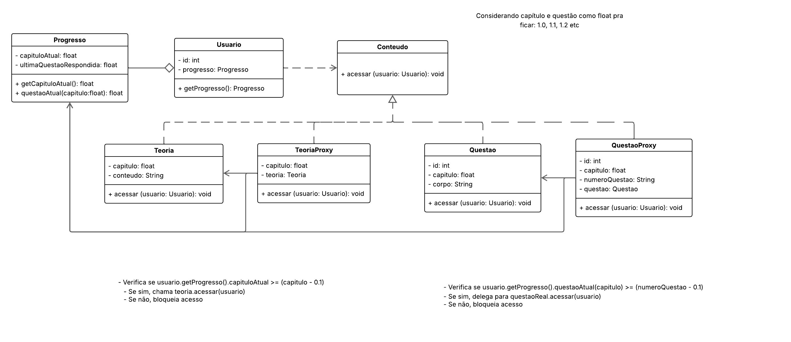

# 3.2.- GoFs Estruturais

## Proxy 

### Introdução

O padrão de projeto Proxy pertence ao grupo dos padrões estruturais e tem como principal propósito fornecer um substituto ou representante para outro objeto. Ele atua como um intermediário, controlando o acesso ao objeto real, o que permite executar funcionalidades adicionais — como validações, cache ou controle de acesso — sem modificar diretamente o objeto original [1].

O Proxy é particularmente útil em situações onde o objeto real é custoso para ser instanciado (por exemplo, quando exige acesso a recursos externos, como banco de dados ou arquivos), ou quando queremos garantir que certas condições sejam verificadas antes da interação com esse objeto.

De modo prático, o Proxy implementa a mesma interface do objeto real, sendo capaz de ser utilizado no lugar dele de forma transparente. O cliente interage com o Proxy como se estivesse interagindo com o objeto original, sem saber que há uma camada adicional de controle intermediando essa comunicação.

Esse padrão é amplamente utilizado em contextos como:
- Controle de acesso (Protection Proxy);
- Inicialização sob demanda (Virtual Proxy);
- Registro de chamadas (Logging Proxy);
- Cache de resultados (Caching Proxy);
- Representação local de objetos remotos (Remote Proxy).

### Exemplo de aplicação no BrinCalango

No sistema BrinCalango, o padrão Proxy foi utilizado para controlar o acesso a conteúdos educacionais, como teorias e questões. A proposta surgiu da necessidade de garantir que os usuários interajam apenas com conteúdos apropriados ao seu progresso e faixa etária, sem que seja necessário modificar diretamente as classes originais de conteúdo.

A aplicação do padrão foi dividida em dois Proxys principais:

- TeoriaProxy: verifica se o usuário já alcançou o capítulo correspondente à teoria desejada;
- QuestaoProxy: garante que o usuário já está apto a resolver uma questão específica, com base no seu progresso anterior.

Ambos os Proxys consultam uma instância da classe Progresso, que mantém informações sobre o estágio atual do usuário. Essa abordagem reforça a ideia de separação de responsabilidades e facilita a manutenção e evolução do sistema.

Ilustração da arquitetura Proxy no BrinCalango
A Figura 1 apresenta um esquema visual da interação entre os componentes do padrão Proxy no BrinCalango. A sequência de interação começa com o usuário tentando acessar um conteúdo. A solicitação é interceptada por um Proxy, que valida o progresso do usuário antes de delegar a solicitação ao objeto real (Teoria ou Questão).

<strong>Figura 1 – Modelagem do Proxy</strong>
 

 
<em>Autor: <a href="https://github.com/juliatakaki" target="_blank">Júlia Takaki</a> e <a href="https://github.com/Oleari19" target="_blank">Maria Clara</a>, 2025</em>

### Implementação 

## Referências Bibliográficas

> [1] REFRACTORING.GURU. Proxy. [S. l.], [s. d.]. Disponível em: https://refactoring.guru/design-patterns/proxy. Acesso em: 01 jun. 2025.

## Bibliografia 

> SOURCEMAKING. Proxy. [S. l.], [s. d.]. Disponível em: https://sourcemaking.com/design_patterns/proxy. Acesso em: 01 jun. 2025.

## Histórico de Versões
| Versão | Data       | Descrição                                    | Autor(es)                                                                                              | Revisor(es)                                      | Descrição da Revisão                                                                                  | Commits |
| :----: | ---------- | -------------------------------------------- | -------------------------------------------------------------------------------------------------------- | ------------------------------------------------ | ------------------------------------------------------------------------------------------------------ | -------- |
| 1.0    | 01/06/2025 | Criação e Documentação do Proxy | [Júlia Takaki](https://github.com/juliatakaki) e [Maria Clara](https://github.com/Oleari19)| [Victor Hugo](https://github.com/ViictorHugoo) | Reestruturação e mudança de textos | [Commit1-0](https://github.com/UnBArqDsw2025-1-Turma02/2025.1-T02-_G1_BrinCalango_Entrega_03/commit/c35b578d8c92e70d3772f47c6c39798c28ddfb90) |
