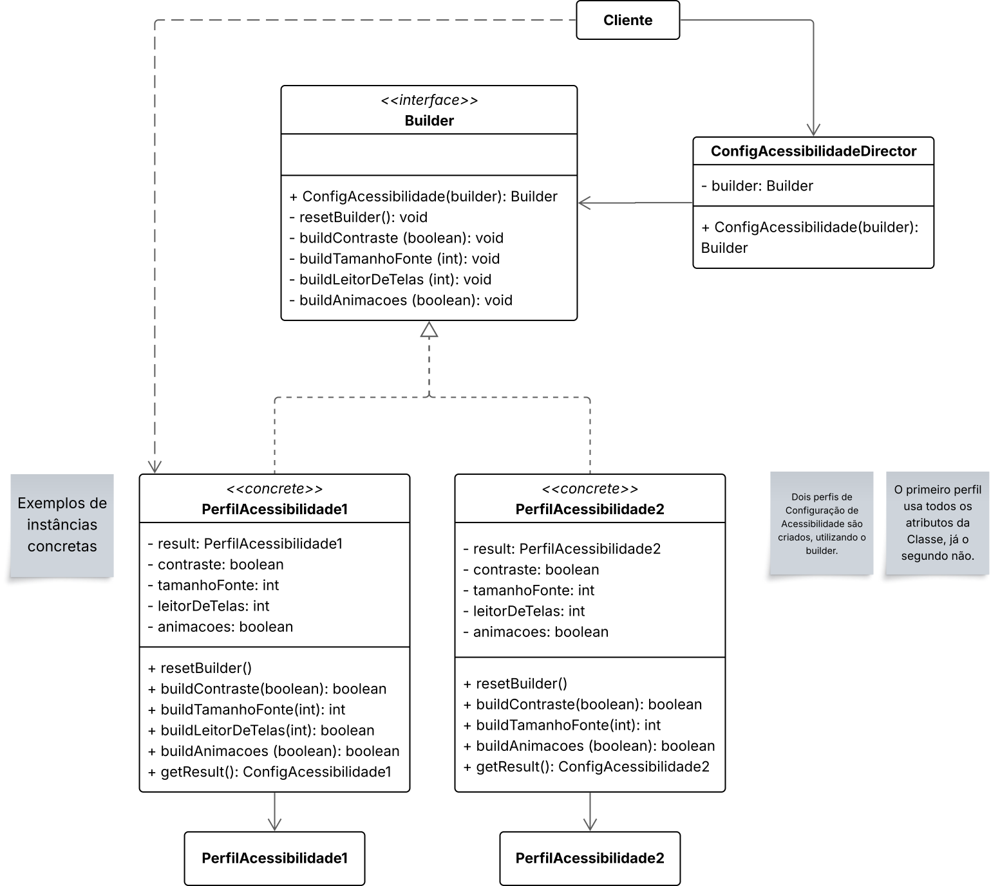
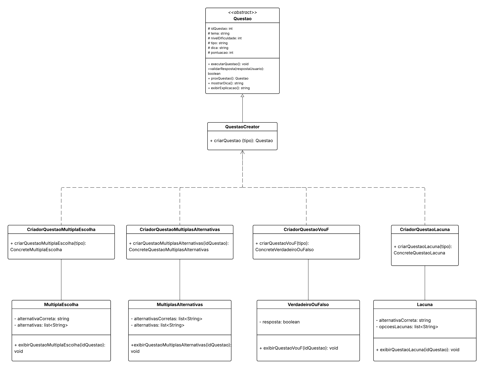
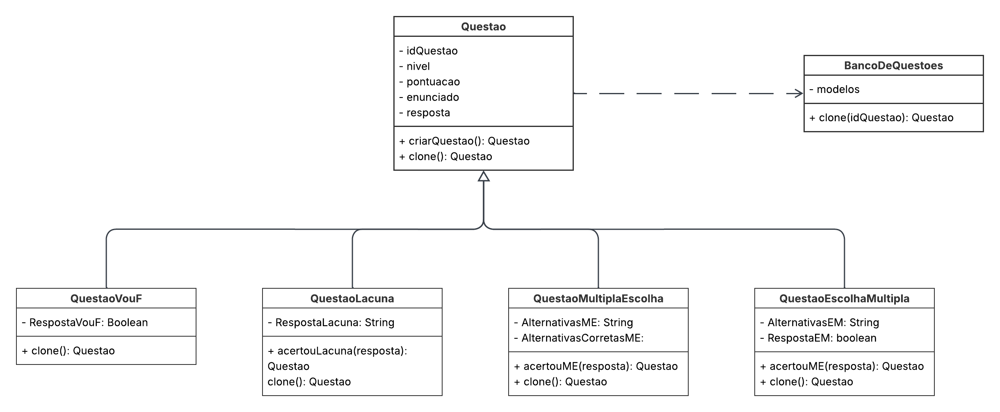
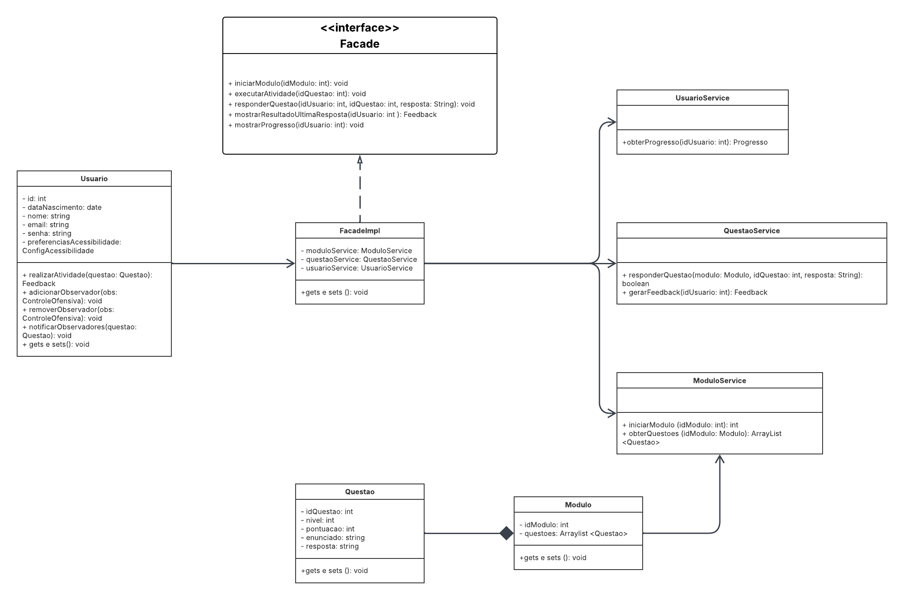
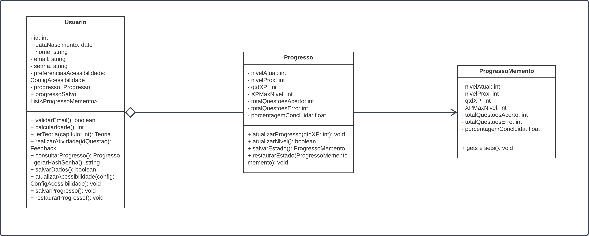
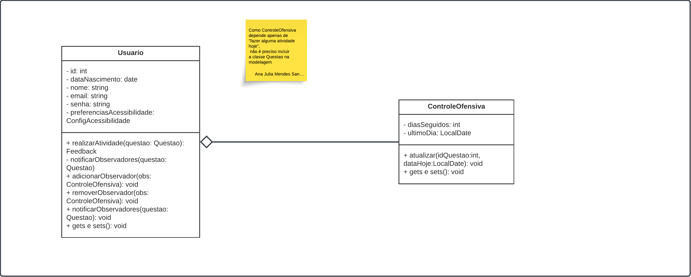
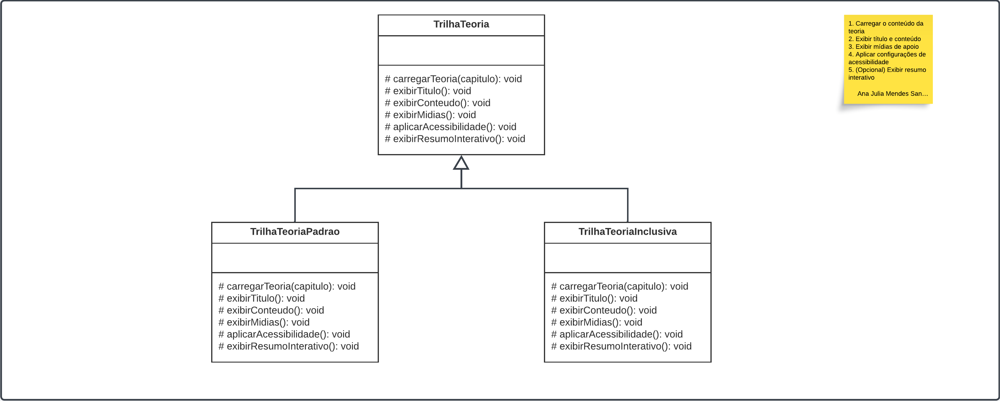

# BrinCalango

**Código da Disciplina**: FGA0208<br>
**Número do Grupo**:  Projeto G1 - Jogo Educacional<br>
**Entrega**: 03<br>

## Alunos
| Matrícula   | Aluno                                         |
|-------------|-----------------------------------------------|
| 211041099   | Ana Catarina Lopes e Vasconcelos dos Santos   |
| 221007798   | Ana Julia Mendes Santos                       |
| 222037648   | André Cláudio Maia da Cunha                   |
| 222033952   | Cristiano Borges de Morais                    |
| 222006660   | Diogo Rodrigues Barboza                       |
| 221022355   | Júlia Rocha Fortunato                         |
| 221029249   | Júlia Takaki Neves                            |
| 202016720   | Luana Ribeiro Soares                          |
| 221008338   | Maria Clara Oleari de Araújo                  |
| 222007021   | Maurício Ferreira de Araújo                   |
| 211063256   | Victor Hugo Rodrigues Guimarães               |

## Sobre 
BrinCalango é uma aplicação web educacional que simula um jogo gamificado, voltado ao ensino da lógica de programação e da linguagem Calango, com foco na acessibilidade e inclusão do público infantojuvenil. Seu principal objetivo é despertar o interesse de crianças e adolescentes pela lógica de programação, por meio de atividades envolventes, intuitivas e lúdicas. Além disso, busca democratizar o acesso ao conhecimento tecnológico e apoiar o desenvolvimento de habilidades computacionais desde os primeiros anos da vida escolar.

O grande diferencial do BrinCalango está em seu compromisso com a acessibilidade digital. Na primeira versão do aplicativo, será buscado o atendimento ao maior número possível de critérios das diretrizes WCAG 2.2 e da norma brasileira NBR 17225, com a intenção de evoluir continuamente em futuras atualizações. O jogo será desenvolvido com linguagem simples e opções de configuração que permitam sua adaptação às necessidades de crianças com ou sem deficiência, promovendo uma experiência inclusiva e significativa para todos.

## Screenshots da Terceira Entrega
### GOFs - Criacionais
#### Builder


#### Factory Method


#### Prototype


### GOFs Estruturais
#### Facade


#### Proxy


### GOFs Comportamentais
#### Memento


#### Observer


#### Template Method


## Há algo a ser executado?

(X) SIM

( ) NÃO

### Como Executar o Projeto

#### Pré-requisito 

Possuir Java 21 ou superior instalado na máquina. 

Se voc^Você pode baixar o Java 21 no link abaixo:

```
https://www.java.com/pt-BR/download/manual.jsp
```

#### 1. Clonar o repositório

Clone este repositório em sua máquina:

```bash
git clone <url-do-repositorio>
```

#### 2. Acessar o diretório do padrão desejado

Navegue até a pasta que contém a implementação do padrão de projeto que deseja executar:

```bash
cd ./implementation/<nome-do-padrao>
```

#### 3. Compilar o projeto

Compile o arquivo `Main.java` junto com os demais diretórios (exceto o `out`):

```bash
javac -d ./out Main.java ./<outros-diretorios>
```

#### 4. Executar o projeto

Rode a aplicação:

```bash
java -cp ./out Main
```

---

## Informações Complementares 
Quaisquer outras informações adicionais podem ser descritas nessa seção.
